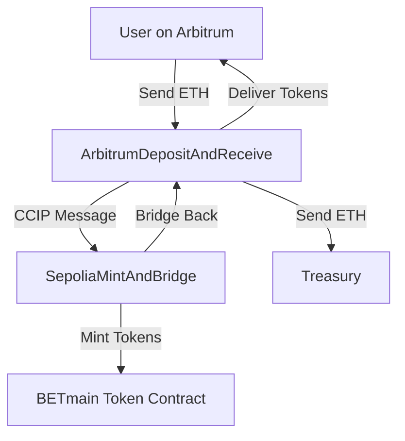

# 🚀 BET Token Protocol

> **AI Strategy Betting Protocol with Cross-Chain Token Distribution**

An innovative blockchain protocol that combines artificial intelligence strategy evaluation with automated market maker liquidity provision, featuring seamless cross-chain token distribution via Chainlink CCIP.

---

## 🌟 Overview

The BET Token Protocol revolutionizes decentralized prediction markets by enabling users to:

- **Submit trading strategies** for AI-powered evaluation
- **Earn rewards** based on strategy performance using mathematical scoring curves
- **Exchange ETH for BETmain tokens** across multiple blockchain networks
- **Benefit from cross-chain accessibility** while maintaining optimal speed and cost efficiency

### Key Innovation
Our **round-trip cross-chain architecture** allows users to deposit ETH on Arbitrum and receive BETmain tokens back on Arbitrum, while the actual token minting occurs on Ethereum Sepolia for maximum security and decentralization.

---

## 🏗️ Architecture

### System Overview

### Cross-Chain Flow

1. **User Deposits** ETH on Arbitrum Sepolia
2. **CCIP Bridge** sends request to Ethereum Sepolia
3. **Sepolia Contract** mints BETmain tokens
4. **CCIP Bridge** returns tokens to Arbitrum
5. **User Receives** BETmain tokens on Arbitrum
6. **Treasury Collects** ETH automatically

---

## 📋 Deployed Contracts

### Ethereum Sepolia Testnet

| Contract | Address | Purpose |
|----------|---------|---------|
| **BETmain Token** | `0x5F4743a164e87C5596C30BE8e2C5119b5cfE48a5` | Universal base token with minting capabilities |
| **ETH Exchange** | `0xB889Eb906Eb01E0E82ca457981AF230C627B1Ae3` | Local ETH → BETmain exchange |
| **CCIP Bridge** | `0x22F6Db6967ac3b17848f0411648c4A47355DB7Cd` | Receives requests & bridges tokens back |

### Arbitrum Sepolia Testnet

| Contract | Address | Purpose |
|----------|---------|---------|
| **Deposit & Receive** | `0x37Cc04eAb33A9F4cf945B440cAF6E87a79Ca534A` | Handles user deposits & token delivery |

### CCIP Infrastructure

| Network | Router Address |
|---------|----------------|
| **Ethereum Sepolia** | `0x0BF3dE8c5D3e8A2B34D2BEeB17ABfCeBaf363A59` |
| **Arbitrum Sepolia** | `0x2a9C5afB0d0e4BAb2BCdaE109EC4b0c4Be15a165` |

---

## 💰 Token Economics

### BETmain Token Specifications

- **Symbol**: BETmain
- **Standard**: ERC-20
- **Decimals**: 18
- **Max Supply**: 1,000,000,000 tokens
- **Initial Supply**: 1,000,000 tokens (to treasury)

### Exchange Rates

| ETH Amount | BETmain Tokens | Use Case |
|------------|----------------|----------|
| 0.0003 ETH | 100 BETmain | Small test transaction |
| 0.001 ETH | 333 BETmain | Typical user deposit |
| 0.01 ETH | 3,333 BETmain | Larger investment |
| 1 ETH | 333,333 BETmain | Maximum efficiency |

### Fee Structure

- **Local Exchange (Sepolia)**: No protocol fees
- **Cross-Chain Bridge**: CCIP fees (~$3-5 per transaction)
- **Treasury Collection**: 100% of deposited ETH

---

## 🔧 Technical Features

### Smart Contract Capabilities

#### BETmain Token
- ✅ **Authorized Minting System**: Only approved contracts can mint tokens
- ✅ **Pausable Functionality**: Emergency stop mechanism
- ✅ **Daily Mint Limits**: 10M tokens per day maximum
- ✅ **Testnet Mode**: Easy testing and development features

#### Cross-Chain Bridge
- ✅ **Replay Attack Prevention**: Secure message handling
- ✅ **Chain Validation**: Ensures messages from authorized networks
- ✅ **Emergency Withdrawals**: Owner can recover stuck funds
- ✅ **Fee Estimation**: Users can calculate costs before transactions

#### Exchange System
- ✅ **Automatic Rate Calculation**: Dynamic token amount computation
- ✅ **Min/Max Limits**: Configurable deposit boundaries
- ✅ **Treasury Integration**: Seamless ETH collection
- ✅ **Statistics Tracking**: Comprehensive user and system metrics

### Security Measures

- **Multi-Signature Ownership**: Critical functions require owner authorization
- **Input Validation**: All user inputs are thoroughly validated
- **Reentrancy Protection**: Guards against recursive call attacks
- **Gas Limit Controls**: Prevents transaction failures due to gas issues

---

## 🌐 Network Support

### Current Networks
- **Ethereum Sepolia** (Primary Token Network)
- **Arbitrum Sepolia** (User Interaction Network)

### Planned Expansion
- Avalanche Fuji
- Polygon Mumbai
- Base Sepolia
- Additional EVM-compatible networks

---

## 📊 Current Status

### ✅ Completed Features
- [x] BETmain token deployment and configuration
- [x] Local ETH exchange system (Sepolia)
- [x] Cross-chain bridge contracts deployment
- [x] CCIP integration and testing
- [x] Basic security auditing

### 🚧 In Development
- [ ] Cross-chain transaction testing and optimization
- [ ] AI strategy evaluation system integration
- [ ] Frontend user interface development
- [ ] Additional network deployments

### 🔮 Future Roadmap
- [ ] Automated Market Maker (AMM) pools for strategy tokens
- [ ] Advanced AI scoring algorithms
- [ ] Governance token launch
- [ ] Mainnet deployment

---

## 🧪 Testing

### Test Networks
All contracts are currently deployed on testnets for safe development and testing:

- **Ethereum Sepolia**: Primary token operations
- **Arbitrum Sepolia**: User interaction testing
- **CCIP Testnet**: Cross-chain functionality

### Testing Tools
- **Remix IDE**: Smart contract development and deployment
- **CCIP Explorer**: Cross-chain transaction monitoring
- **Testnet Faucets**: Free tokens for development

---

## 📈 Performance Metrics

### Target Performance
- **Cross-Chain Speed**: <30 seconds for complete round-trip
- **Success Rate**: >99% for valid transactions
- **Cost Efficiency**: <$10 total cost per cross-chain exchange
- **Gas Optimization**: Minimized transaction costs

### Current Metrics
- **Local Exchange**: ~$0.01-0.05 per transaction
- **Cross-Chain Bridge**: ~$3-5 per transaction
- **Token Minting**: <100,000 gas per mint operation

---

## 🤝 Contributing

We welcome contributions to the BET Token Protocol! Whether you're interested in:

- **Smart Contract Development**: Solidity expertise
- **Cross-Chain Integration**: CCIP and bridge technology
- **Frontend Development**: User interface design
- **Testing & QA**: Protocol validation and security
- **Documentation**: Technical writing and guides

### Development Principles
- **Security First**: All code must pass security reviews
- **Gas Efficiency**: Optimize for minimal transaction costs
- **User Experience**: Prioritize simple, intuitive interactions
- **Cross-Chain Native**: Design with multi-network support in mind

---

## 📄 License

This project is licensed under the MIT License - see the [LICENSE](LICENSE) file for details.

---

## ⚠️ Disclaimer

This protocol is currently in active development and deployed on testnets only. All contracts are experimental and should not be used with real funds until mainnet deployment and comprehensive security audits are completed.

**This software is provided "as is" without warranty of any kind. Use at your own risk.**

---

## 🔗 Links

- **CCIP Explorer**: [ccip.chain.link](https://ccip.chain.link)
- **Chainlink Documentation**: [docs.chain.link](https://docs.chain.link)
- **OpenZeppelin Contracts**: [openzeppelin.com/contracts](https://openzeppelin.com/contracts)

---

  <strong>Built with ❤️ for the future of decentralized finance</strong>

